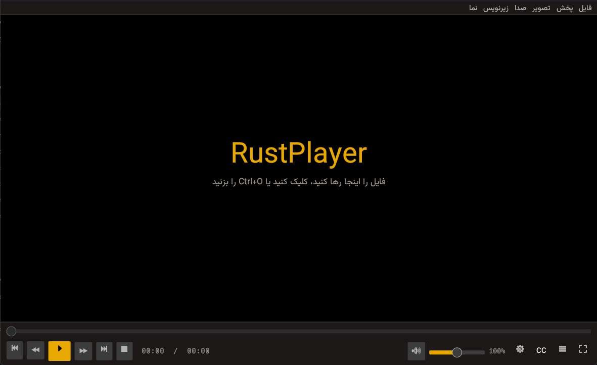

<div align="center">


# RustPlayer

**پخش‌کننده‌ی ویدیو به سبک PotPlayer، نوشته‌شده با Rust، با رابط کاملاً فارسی و راست‌چین**

*A fast, PotPlayer-style media player for Windows with a native Persian (RTL) UI, built with Rust, egui and libmpv.*

[](https://github.com/AmirKhmo/RustPlayer/actions/workflows/windows.yml)
[](https://github.com/AmirKhmo/RustPlayer/releases/latest)
[](https://github.com/AmirKhmo/RustPlayer/releases)
[](LICENSE)


[**⬇️ دانلود آخرین نسخه**](https://github.com/AmirKhmo/RustPlayer/releases/latest)



</div>

<div dir="rtl">

## ✨ ویژگی‌ها

- 🎬 پخش تقریباً همه‌ی فرمت‌ها با موتور **mpv** (FFmpeg)، با پشتیبانی از شتاب‌دهنده‌ی سخت‌افزاری
- 🇮🇷 رابط کاملاً فارسی و راست‌چین با فونت **وزیرمتن**
- 💬 نمایش درست زیرنویس فارسی با libass و رمزگذاری پیش‌فرض **cp1256** (دیگر زیرنویس به‌هم‌ریخته نمی‌بینید)
- 📜 مرورگر زیرنویس (<kbd>F7</kbd>): جستجو، پرش با کلیک و همگام‌سازی با راست‌کلیک
- 🌐 **زیرنویس دوم** برای نمایش هم‌زمان دو زبان، به‌همراه سبک‌های آماده
- 🔁 تکرار A-B، فهرست پخش، فصل‌ها، اسکرین‌شات، اکولایزر و تنظیم رنگ تصویر
- 📦 نسخه‌ی **پرتابل** بدون نیاز به نصب، و فایل **Setup** با ثبت در «Open with»

## ⬇️ نصب

از صفحه‌ی [Releases](https://github.com/YOUR_USERNAME/RustPlayer/releases/latest) یکی از این دو را دانلود کنید:

| فایل | کاربرد |
|---|---|
| `RustPlayer-Setup-x.y.z.exe` | نصب معمولی، با میانبر و ثبت در منوی «Open with» |
| `RustPlayer-x.y.z-portable-win64.zip` | پرتابل: از حالت فشرده خارج کنید و `rustplayer.exe` را اجرا کنید |

## ⌨️ کلیدهای میانبر

| کلید | کار | کلید | کار |
|---|---|---|---|
| <kbd>Space</kbd> | پخش / توقف | <kbd>Enter</kbd> | تمام‌صفحه |
| <kbd>←</kbd> <kbd>→</kbd> | ۵ ثانیه عقب / جلو | <kbd>Ctrl</kbd>+<kbd>←</kbd> <kbd>→</kbd> | ۳۰ ثانیه |
| <kbd>↑</kbd> <kbd>↓</kbd> | صدا | <kbd>M</kbd> | بی‌صدا |
| <kbd>C</kbd> / <kbd>X</kbd> / <kbd>Z</kbd> | تند / کند / سرعت عادی | <kbd>F</kbd> / <kbd>D</kbd> | فریم بعد / قبل |
| <kbd>,</kbd> <kbd>.</kbd> | تأخیر زیرنویس | <kbd>Alt</kbd>+<kbd>S</kbd> | تعویض زیرنویس |
| <kbd>\\</kbd> | تکرار A-B | <kbd>Ctrl</kbd>+<kbd>O</kbd> | باز کردن فایل |
| <kbd>F5</kbd> | تنظیمات | <kbd>F6</kbd> | فهرست پخش |
| <kbd>F7</kbd> | مرورگر زیرنویس | <kbd>F1</kbd> | همه‌ی کلیدها |

## 🛠️ ساخت از سورس (ویندوز)

۱. نصب Rust از [rustup.rs](https://rustup.rs)
۲. نصب Visual Studio Build Tools با گزینه‌ی «Desktop development with C++»
۳. (اختیاری، برای Setup) `winget install JRSoftware.InnoSetup`
۴. اجرای `build.bat`

اسکریپت libmpv و فونت وزیرمتن را خودش دانلود می‌کند و خروجی‌ها را در پوشه‌ی `dist` می‌سازد.

## 🚀 انتشار نسخه‌ی جدید

نسخه را در `Cargo.toml` و `installer/rustplayer.iss` بالا ببرید، `CHANGELOG.md` را به‌روز کنید و یک تگ بزنید:

</div>

```bash
git tag v0.3.1
git push origin v0.3.1
```

<div dir="rtl">

GitHub Actions خودش برنامه را می‌سازد و فایل Setup، نسخه‌ی پرتابل و هش‌ها را در Releases منتشر می‌کند.

## ⚠️ محدودیت‌ها

- متن تایپ‌شده در کادر جستجو، به‌دلیل محدودیت egui، چپ‌به‌راست و با حروف جدا نمایش داده می‌شود. خود جستجو درست کار می‌کند.
- نوار پیشرفت، دکمه‌های پخش و اکولایزر عمداً چپ‌به‌راست مانده‌اند، چون محور زمان و فرکانس هستند.

## 📄 لایسنس

کد RustPlayer تحت لایسنس [MIT](LICENSE) منتشر شده است.
فایل‌های اجرایی شامل libmpv (GPL) و فونت وزیرمتن (OFL) هستند. جزئیات در [THIRD-PARTY-NOTICES.md](THIRD-PARTY-NOTICES.md).

## 🙏 قدردانی

[mpv](https://mpv.io) · [egui](https://github.com/emilk/egui) · [libmpv2-rs](https://github.com/kohsine/libmpv2-rs) · [وزیرمتن](https://github.com/rastikerdar/vazirmatn) · [shinchiro/mpv-winbuild-cmake](https://github.com/shinchiro/mpv-winbuild-cmake)

</div>
